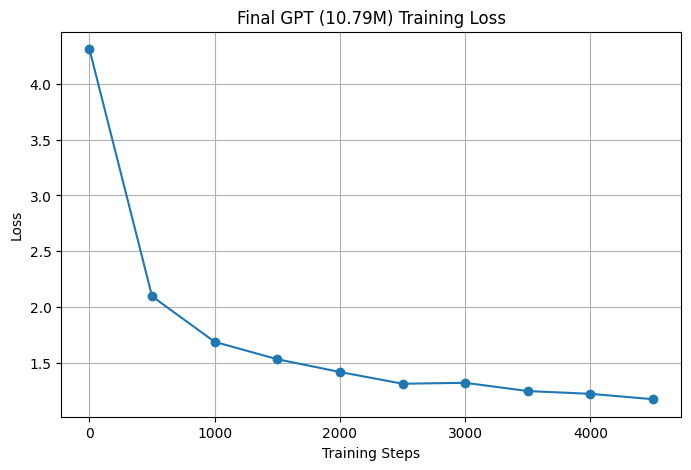

# GPT from Scratch 🤖

A character-level GPT implementation built from scratch in PyTorch, following Andrej Karpathy's "Let's build GPT" series. Trained on the Tiny Shakespeare dataset.

## 🏗️ Architecture

This project progressively builds from a simple Bigram model to a full scaled GPT:

```
Input Tokens
     │
     ▼
Token Embedding + Positional Encoding
     │
     ▼
┌─────────────────────────────┐
│   Transformer Block (×N)    │
│  ┌───────────────────────┐  │
│  │  Multi-Head Attention  │  │
│  │  (Masked, Self-Attn)  │  │
│  └───────────────────────┘  │
│  ┌───────────────────────┐  │
│  │   Feed Forward (MLP)  │  │
│  └───────────────────────┘  │
│   LayerNorm + Residuals      │
└─────────────────────────────┘
     │
     ▼
LayerNorm → Linear → Logits
     │
     ▼
Next Character Prediction
```

**Key components:**
- Character-level tokenizer (vocab_size = 65)
- Multi-head masked self-attention
- Feed-forward layers with ReLU
- Residual connections + Layer Normalization
- Learned positional embeddings

---

## 📊 Model Stats

| Parameter | Value |
|---|---|
| Total Parameters | **10.79M** |
| Final Training Loss | **1.09** |
| Context Length (block_size) | 256 |
| Embedding Dimension (n_embd) | 384 |
| Attention Heads | 6 |
| Transformer Layers | 6 |
| Dropout | 0.2 |
| Dataset | Tiny Shakespeare |

---

## 📈 Training Progress

| Stage | Loss |
|---|---|
| Bigram baseline | ~2.5 |
| Small GPT | 1.87 |
| Scaled GPT (final) | **1.09** |

Training was done on **GPU** (Google Colab) for the scaled model.




---

## 🚀 How to Run

### 1. Clone the repo
```bash
git clone https://github.com/DevD-M/GPT.git
cd GPT
```

### 2. Install dependencies
```bash
pip install torch numpy
```

### 3. Get the dataset
```bash
wget https://raw.githubusercontent.com/karpathy/char-rnn/master/data/tinyshakespeare/input.txt
```

### 4. Train the model
```bash
python gpt.py
```

### 5. Generate text
The model will generate Shakespeare-like text after training. You can modify the `max_new_tokens` parameter to control output length.

---

## 📁 Project Structure

```
GPT/
│
├── gpt.py              # Full GPT implementation (scaled model)
├── bigram.py           # Baseline bigram language model
├── input.txt           # Tiny Shakespeare dataset
└── README.md
```

---

## 🧠 Concepts Implemented

- **Attention mechanism** — scaled dot-product attention: `softmax(QKᵀ / √dₖ) × V`
- **Causal masking** — prevents tokens from attending to future positions
- **Multi-head attention** — multiple attention heads running in parallel
- **Positional encoding** — learned embeddings for token positions
- **Residual connections** — helps with gradient flow in deep networks
- **Layer normalization** — stabilizes training
- **Cross-entropy loss** — for next-token prediction objective

---

## 💡 Key Learnings

1. Self-attention is essentially **communication** between tokens — each token aggregates info from past tokens
2. Feed-forward layers are **computation** — each token processes info independently
3. Residual connections + LayerNorm are critical for training deep transformers
4. Scaling from Bigram → GPT reduced loss from ~2.5 → 1.09

---

## 📚 References

- [Andrej Karpathy — Let's build GPT from scratch](https://www.youtube.com/watch?v=kCc8FmEb1nY)
- [Attention Is All You Need (Vaswani et al., 2017)](https://arxiv.org/abs/1706.03762)
- [nanoGPT by Karpathy](https://github.com/karpathy/nanoGPT)

---

*Built as part of a 60-day AI/ML learning sprint — implementing transformers from scratch to understand the internals deeply.*
